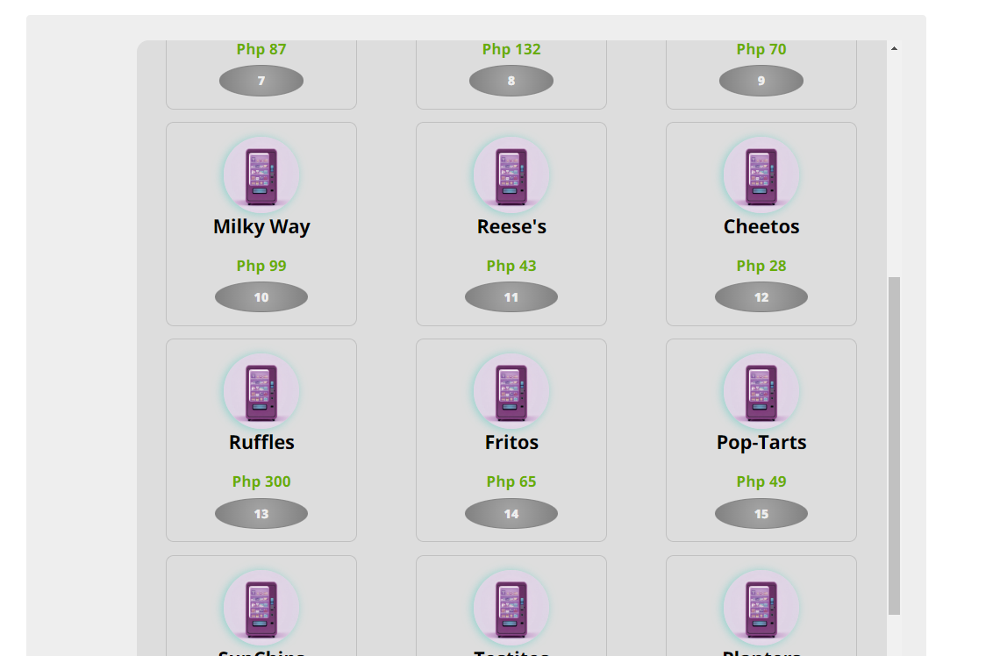
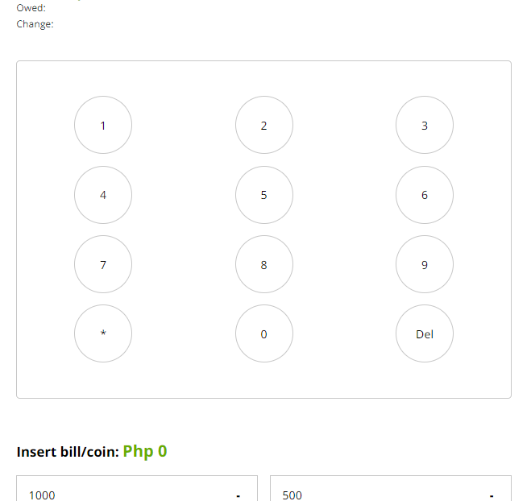
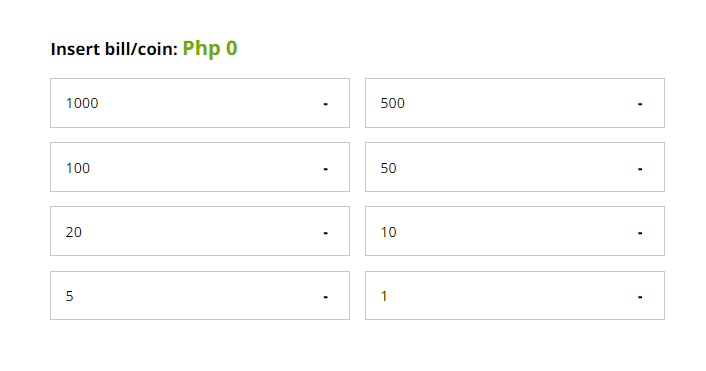
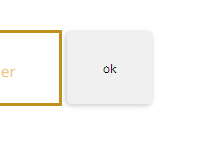
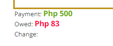
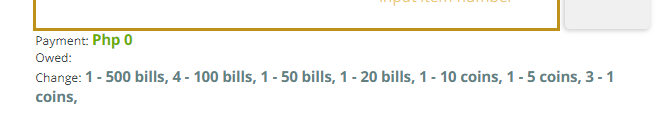
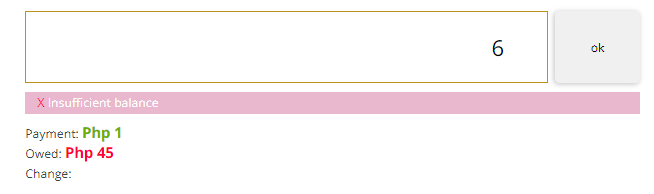
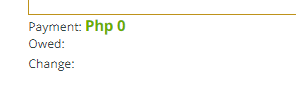
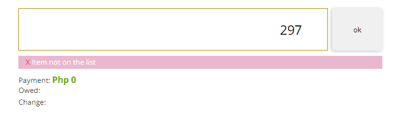

# Vue Vendor Application

The Vending Machine project is a simple user-friendly Vue.js application that
simulates a real vending machine. Users can easily input item numbers
and view their selections through an intuitive interface.

## Recommended IDE Setup

[VSCode](https://code.visualstudio.com/) + [Volar](https://marketplace.visualstudio.com/items?itemName=Vue.volar) (and disable Vetur).

## Project Dependencies

The following dependencies are required to run the application:

### Production Dependencies

    - vue: ^3.5.12

### Development Dependencies

    - @eslint/js: ^9.12.0
    - @vitejs/plugin-vue: ^5.1.4
    - @vitejs/plugin-vue-jsx: ^4.0.1
    - eslint: ^9.12.0
    - eslint-plugin-vue: ^9.29.0
    - sass: ^1.80.2
    - sass-loader: ^16.0.2
    - vite: ^5.4.8

### Scripts

The following scripts are available:

    - dev: Starts the development server using Vite.
    - build: Builds the application for production.
    - preview: Starts the preview server using Vite.
    - lint: Runs ESLint to check for code errors and warnings.

# Project Setup/Installation

```sh
npm install
```

### Compile and Hot-Reload for Development

```sh
npm run dev
```

# Usage

## 1. You can browse item on vending machine



## 2.Input the number of item you want to purchase using the keypad



## 3. Add or minus desired bill by clicking on the bill desired



## 4. Hit ok and it will display the change



## 5. Alternatively we can monitor bills, owed and your change just right below the input field





## 6. If conditions is not satisfied regarding the bill, owed and change, it will display an error message






